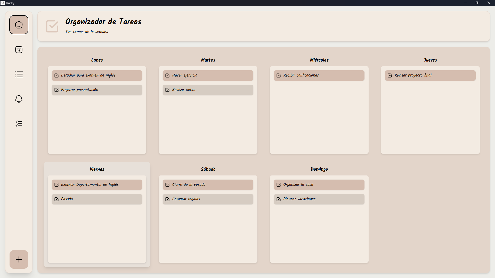
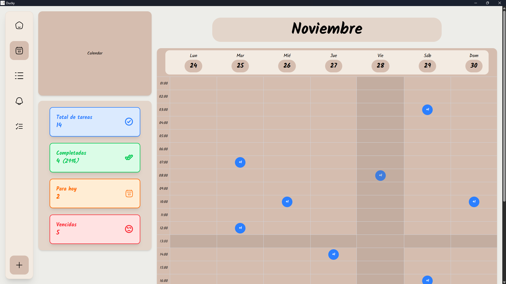
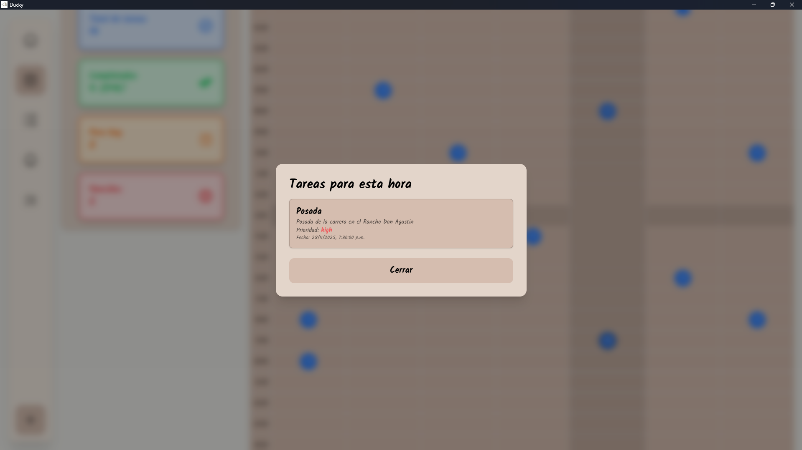

# Estructura de Patos

Este es el proyecto final de Estructuras de Datos, en el cual tenemos que hacer una app con Python y usando algunas estructuras de datos, en las cuales usamos Arboles Binarios y Listas Enlazadas.
El proyecto fue creado con Flask para el backend y React para el frontend, y se compila todo en un solo ejecutable usando PyInstaller, usando SQLite como base de datos.

## Imagenes de la App




## 1. Clonar el respositorio
```bash
git clone https://github.com/MrMikeDevTech/EstructurasDePatos.git
```

## 2. Entramos a la carpeta
``` bash
cd EstructurasDePatos
```

## 3. Compilar toda la app
El proyecto incluye un script `.bat` que compila todo el proyecto, desde el frontend hasta el backend, y genera un ejecutable usando PyInstaller.

``` bash
./build.bat
```

## 4. Ejecutar el programa
El ejecutable se encuentra en la carpeta `dist` generada por PyInstaller.

``` bash
./dist/MiTodoApp.exe
```

## 5. Ejecutar el proyecto en modo desarrollo (opcional)
Puedes ejecutar el backend y frontend por separado para desarrollo.

``` bash
# Para el backend
python main.py

# Para el frontend
cd src/frontend

bun dev
```
